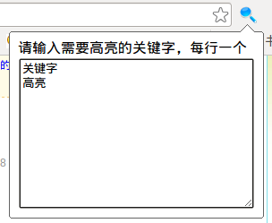
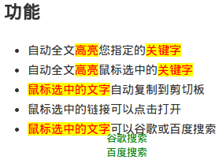

# chrome浏览器自动高亮关键词插件

### 功能

- 自动全文高亮您指定的关键字
- 自动全文高亮鼠标选中的关键字
- 鼠标选中的文字自动复制到剪切板
- 鼠标选中的链接可以点击打开
- 鼠标选中的文字可以谷歌或百度搜索

### 使用方法

- 安装这个插件
- 点击chrome右上角搜索图标
- 在文本框中输入您要高亮的关键字

如下图所示

### 高亮效果

上图中“高亮”和“关键字”已经设置为高亮，可以看到背景颜色是黄色，文字颜色是红色。

“鼠标选中的文字”用鼠标选中后，自动高亮，并且复制到了剪切板，右下角出现了谷歌搜索和百度搜索超链接。

